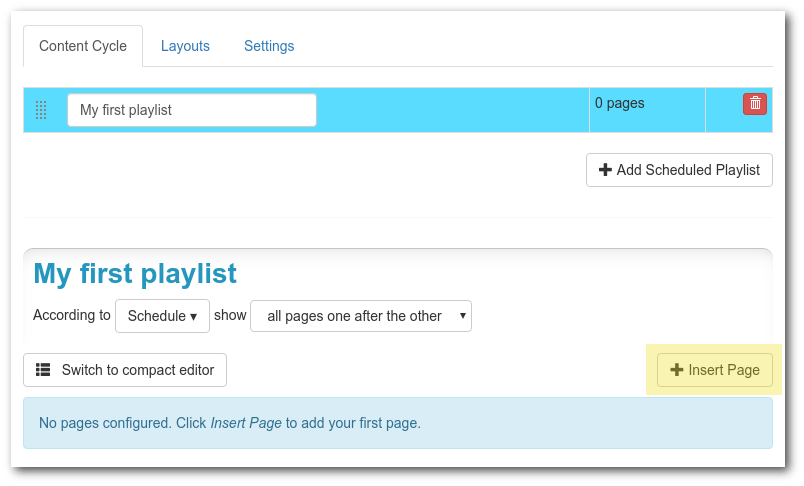
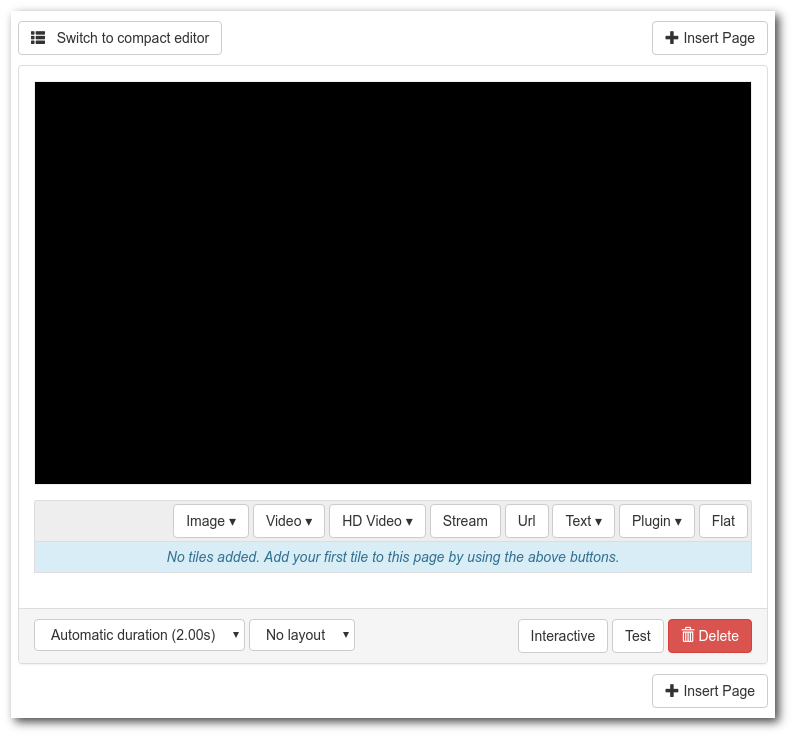
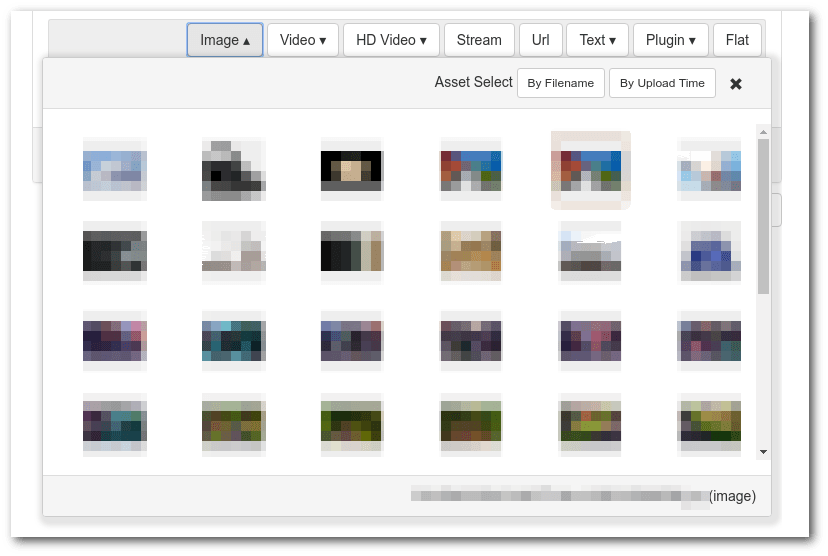
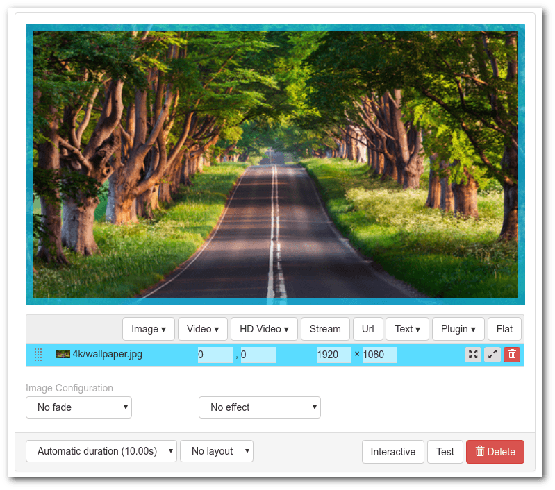
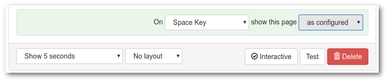
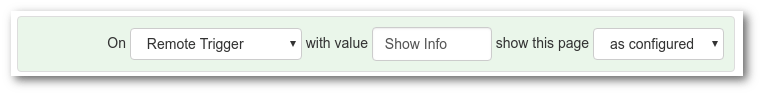
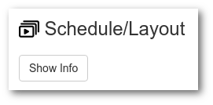

# Scheduled Playlist with Animations

This package allows you to create scheduled content with custom animations.
It will be the default package for all info-beamer customers in the future.
Right now it's still very much in development.

## Configuration Screen

Once you install this package, create a new setup by clicking the **Create Setup** button.
You'll end up in the setup configuration page that allows you to configure your
setup.

## Configuring a Setup

This package allows you to play a configured "content cycle" indefinitely. Each
content cycle consists of any number of playlists that can be scheduled individually.
A playlist itself then consists of any number of pages. 

A page itself can combine content from various sources. It can for example show
images, videos, twitter content, a live stream or even a web page. You can freely
place the content on each page.

Here is how the initial configuration interface of a new setup looks like. A
playlist named *My first playlist* has already been created. Right now that
playlist has no pages added to it.

It's time to change that: Click the *Insert Page* button (marked in yellow in
the above screenshot) to create a new page. A new (empty) page will be added. Your
interface will look like this:

Let's walk through the individual controls one-by-one: In the top right and
bottom right you see more *Insert Page* buttons. They can be used to add another
page before of after this page. That way you can add more pages to a single
playlist.

The black area represents your screen. Right now it's completely empty as
you didn't add a tile yet. You can add content to your page using the row
of buttons starting with *Image*. More on that in a moment.

At the bottom of each page you see a way to specify a duration, use one of your
layouts (more on that later). In the bottom right part you can select an interactive
trigger which allows end users of your setup to select a page using a connected
keyboard. The test button allows you to temporarily show this page exclusively
on the screen. This can be useful to preview the page you're working on a device
without having to wait for it if you have multiple pages. Finally you can delete
the page.

Let's add an image to your empty page. Click on the *Image* button and a popup
will open that allows you to select any of the images in your account:

Select one of the images to add it to your page. The result will look something
like this:

In the above screen area you can use drag and drop the edges and corners of
your added tile to change its size or drag and drop the tile to move it around.
The highlighted tile row below the screen area gives some details about each
of your tiles: It's file name, positions and size on the screen as well as
buttons that resize the tile or delete it.

If you add multiple tiles on a single page you can change their display order
using the dotted drag/drop area on the left. Grab it and reorder your individual
tiles.

The tile selected will also optionally show additional configuration options
below the tile list: For images you can specify a fade and movement effect.
Other tiles have various other options available.

## Interactivity

You can create limited interaction using this package. All pages have the option
to be triggered by some kind of external event. This can be a key press, a 
button push on a connected Xbox controller, a GPIO event or a remote event
triggered using the API.

One pattern when creating interactive content is that you create a new
playlist and set its schedule so that it's never scheduled. Then you can
add any number of pages to this playlist. This of course isn't useful
yet, as none of its pages are every shown by default. Instead you can then
use the interaction feature to trigger these pages.

First click the *Interactive* button at the bottom of the page. You'll
get a new row for setting interaction options:

You can select a number of different triggers from the drop down list.

If you select *Remote Trigger* you get an additional textbox where
you can specify a trigger name.

Later when this setup is installed on any of your devices, you can
trigger this event from the device detail page of that device. A
new button is added to the page and clicking it will trigger the
event remotely.

# Offline

This package can work offline, but only if some features are not used:

 * Playlists that use a date/time in their schedule will not work unless
 the the device got a correct system time using NTP. Alternatively it
 is possible to use a hardware based RTC to store time across reboots.
 See [here](https://info-beamer.com/doc/device-configuration#pcf8523rtc).
 * Anything using remote content will not work. This includes the browser,
 frab and streaming abilities.

## Changelog

Got feedback? Don't hesitate to get on contact with info-beamer support here:
https://info-beamer.com/contact

### Version 19

 * Fixed deleted layouts preventing pages that used that layout from playing
 * Prevent layout reordering by deletion
 * Updated documentation
 * Update browser snapshot immediately on receiving update
 * Triggers can now optionally enqueues all pages using that trigger, not just the next one

### Version 18

 * Rework UI to add tiles. Split into two and hide less used special tile types.
 * Simplified "Compact playlist editor" and make use of the native asset selector.
 * Reworked twitter tile to make use of a new info-beamer provided twitter API.
 * A remote trigger now schedules all pages having the matching trigger keyword instead of only a single one.
 * Added "Copy" button to copy a page.
 * Click on an image/video filename in the tile list to change the assets.

### Version beta17

 * Now compatible with the Pi4

### Version beta16

 * Added 'fallback' schedule option: Playlist scheduled as 'fallback' are only active if no other non-fallback playlist is scheduled.

### Version beta15

 * Fixed weather forecast day names. Thanks [northtree](https://community.infobeamer.com/t/time-date-boxes/98/6).
 * Items that are always schedulable will show even if the device has no correct time
 * Added audio option to stream

### Version beta14

 * Added audio option to videos
 * More browser plugin options
 * Add option to disable a page by selecting "Deactivate" in its duration dropdown

### Version beta13

 * Fixed the weather 24h forecast tile. It would sometimes stop showing its content
 after a while.

### Version beta12

 * Added experimental support to show web content from any publicly reachable url. The
rendered browser output might be cached for a few minutes. You also can't show any kind
of animated web content that way. It works best for news pages or similar static content.

### Version beta11

 * Added a streaming tile. You can specify any support stream url (`rtsp://`, `http://.../stream.m3u8`) or
 a stream generated by the *Multicast Video Streamer* package:
 
https://info-beamer.com/pkg/7314

### Version beta10

 * Added a weather plugin

### Version beta9

 * Updated Twitter API client to load longer tweets.

### Version beta8

 * Fixed incorrect handling of hour based schedules.
 * Made 'Simulate Time' feature use the selected timezone instead of UTC.

### Version beta7

 **Warning**: The plugins feature has been removed and setups that used this feature will require reconfiguration.

 * Added Layout feature. Allows you to define a base layout that you can then reuse in all pages.
 * More Interface Cleanups. Still not very good, but we're getting there. Feedback welcome!
 * More precise layout as you can now manually specify coordinates
 * Interactivity: Use a connected Keyboard to cycle or jump to individual pages

### Version beta6

 * Added debug mode that only shows a single page on repeat
 * Added Markdown support.

### Version beta5

 * Compact view for playlist editing. Rapidly create pages by just dragging assets to the playlist
 * Slightly improved asset search.

### Version beta4

 * Avoid using new JS syntax to make it more compatible with older browsers
 * Added icon

### Version beta3

 * Added Timespan based scheduling

### Version beta2

 * Added support for raw videos and basic animations for images

### Version beta1

 * Initial release
